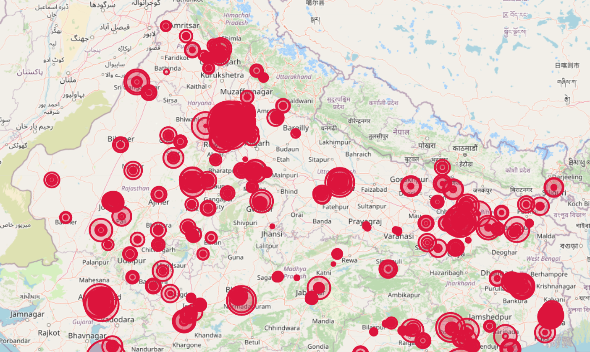
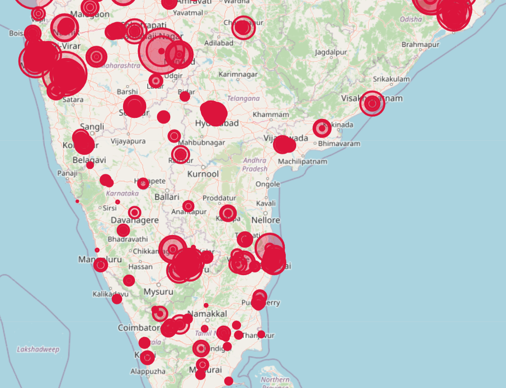

# Exploratory Data Analysis of India's Air Quality Dataset

This repository contains the code and analysis for exploring air quality data across various cities and states in India.

## Dataset Overview

The dataset includes the following columns:
- state
- city
- station
- last_update
- latitude
- longitude
- pollutant_id
- pollutant_min
- pollutant_max
- pollutant_avg

## Analysis Performed

1. **Basic Data Overview**
   - Data shape, types, and missing values check

2. **Pollutant Distribution Analysis**
   - Histogram of average pollutant levels

3. **Top Polluted Cities**
   - Bar chart of cities with highest average pollution

4. **Geographical Distribution**
   - Interactive map showing pollution levels across India

5. **State-wise Comparison**
   - Bar plot comparing average pollution levels by state

6. **Pollutant Correlation Analysis**
   - Heatmap of correlations between pollutant metrics

7. **Pollutant Variability Analysis**
   - Boxplot of pollutant types vs average concentration

## Screenshots

### Geographical Distribution Map (North India)

### Geographical Distribution Map (South India)

## Requirements

- Python 3.x
- pandas
- matplotlib
- seaborn
- folium

